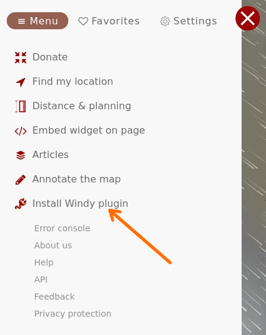
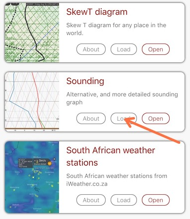
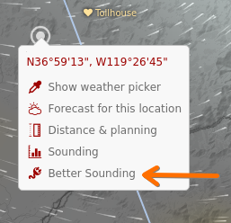
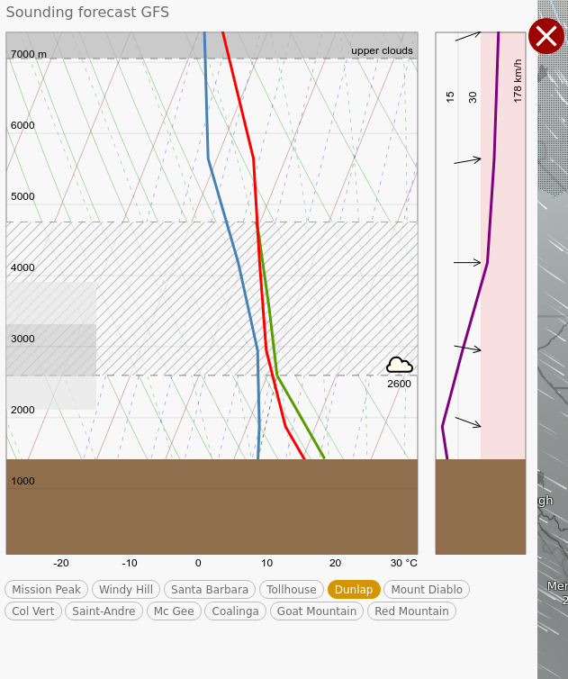

# windy-plugin-sounding

Sounding forecast for paraglider pilots.

You can load the plugin on mobiles and tablets by visiting [https://www.windy.com/plugins/windy-plugin-sounding](https://www.windy.com/plugins/windy-plugin-sounding).
(Note that the mobile application does not support plugins for security reasons).

## How to use the plugin

1) Click on the hamburger menu at the top left of windy.com:

2) Click on "Install Windy Plugin":

3) Load the "Sounding" plugin:

4) Right-click anywhere on the map and select "Better Sounding" to display the sounding forecast:

The sounding appears on the left side of screen:

A few notes:
- On desktop, you can scroll (mouse wheel) on the sounding diagram to go forward/backward in time - (pressing ctrl or shift will jump to the next/previous day),
- On touch devices, swiping left or right on the plugin will go backward or forward in time,
- The blue line shows the dewpoint,
- The red line shows air temperature,
- The green line shows the temperature of an ascending parcel,
- The hatched area across the graph shows the convective layer (cumulus clouds),
- The left area shows clouds (excluding cumulus),
- The top-most area show upper level clouds (i.e. up to ~15km),
- The wind graph shows wind from 0-30km/h in the left part (white background) and from 30 to max speed in right part (red background),
- On desktop, the subtitle shows which model is used ("GFS" in this example - note that not all models are supported),
- The axis units match your windy settings.

Credits:
- [windy.com](https://www.windy.com) for their great web app and exposing the required data,
- [windy-plugin-skewt](https://github.com/johnckealy/windy-plugin-skewt) by [by John C. Kealy](https://github.com/johnckealy) for some initial inspiration,
- [MetPy](https://unidata.github.io/MetPy) for the maths,
- [Preact](https://preactjs.com/) for the small footprint framework,
- Icons by [Yannick](https://www.flaticon.com/authors/yannick),
- [Loading Indicator](https://github.com/SamHerbert/SVG-Loaders) by Sam Herbert,
- and also [d3](https://d3js.org/), [Babel](https://babeljs.io/), [ESLint](https://eslint.org/), [SVGOMG](https://jakearchibald.github.io/svgomg/), ...
